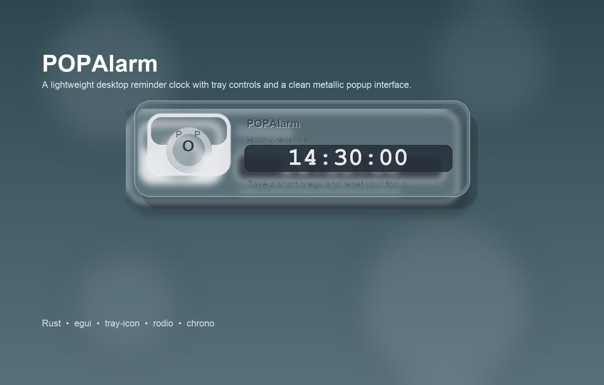

# POPAlarm

[](LICENSE)

POPAlarm is a lightweight desktop reminder app designed for focused work, break prompts, and time-based visual nudges. It runs quietly in the tray, appears with a compact metallic popup clock at scheduled times, and keeps configuration simple through a lightweight settings window and `conf.ini`.

Built for users who want a reminder utility that feels cleaner and more intentional than a generic timer, POPAlarm combines a low-friction desktop workflow with a visually distinct popup interface.

The current version includes:

- A metallic-style popup interface
- Tray integration
- Dock visibility on macOS
- A basic in-app `Settings` window
- `conf.ini`-based configuration for advanced control



## Download / Install

### macOS

If you are using a packaged build, open the installer disk image and drag the app into `Applications`:

- `POPAlarm-Installer-Styled-macOS.dmg`

If you already have the app bundle locally, you can also run it directly:

- `POPAlarm.app`

### Build from Source

To build the project locally:

```bash
cargo build --release
```

The compiled executable will be generated at:

```bash
target/release/popalarm
```

## Features

- Scheduled popup reminders using `HH:MM:SS`-style trigger rules
- Countdown mode for repeated reminder intervals
- Tray menu with `Settings`, `Countdown`, `About`, and `Quit`
- Compact popup UI with custom styling
- Optional sound playback on reminder events
- Optional tips text shown in the popup
- Configurable colors, fonts, timezone, popup duration, and screen position
- `conf.ini` persistence for runtime settings

## Tech Stack

POPAlarm is built with the following Rust libraries:

- [Rust](https://www.rust-lang.org/)
- [egui](https://github.com/emilk/egui)
- [eframe](https://github.com/emilk/egui/tree/master/crates/eframe)
- [rodio](https://github.com/RustAudio/rodio)
- [tray-icon](https://github.com/tauri-apps/tray-icon)
- [chrono](https://github.com/chronotope/chrono)
- [rust-ini](https://github.com/zonyitoo/rust-ini)

## Project Structure

- `src/`: application source code
- `assets/`: bundled assets such as icons, fonts, and default sounds
- `conf.ini`: runtime configuration
- `POPAlarm.app`: macOS app bundle
- `POPAlarm.iconset`: macOS icon resources

## Installation

1. Install Rust using [rustup](https://rustup.rs/).
2. Clone this repository.
3. Build the release version with `cargo build --release`.
4. Launch the app from the generated binary or packaged app bundle.

## Running the Application

### Launch from Source Build

```bash
./target/release/popalarm
```

### Launch the macOS App Bundle

Double-click:

```bash
POPAlarm.app
```

## Configuration

POPAlarm reads its settings from `conf.ini`.

If you run the app bundle, the active runtime configuration is typically stored next to the executable inside the app bundle:

```bash
POPAlarm.app/Contents/MacOS/conf.ini
```

If you run the compiled binary directly, the app reads the `conf.ini` located next to that executable.

### Settings Window

The current version also includes a basic in-app `Settings` window accessible from the tray menu. It can edit and save common settings such as:

- Reminder times
- Countdown sequence
- Tips text
- Popup display duration
- Popup side and position percentage
- Timezone offset
- Rounded corner toggle

### Configuration Keys

#### `time`

Controls when the popup appears. Use `hour:minute:second` format. Multiple triggers can be separated with commas.

Examples:

```ini
time=:30:
time=:30:,15::0
```

#### `sound`

Controls the audio file played when a reminder is triggered.

Examples:

```ini
sound=sound.ogg
sound=assets/1.mp3|assets/2.mp3
sound=assets/1.mp3|assets/2.mp3*assets/3.mp3|assets/4.mp3
```

#### `countdown`

Defines countdown intervals using `hour:minute:second` format.

Example:

```ini
countdown=:20:,::20
```

#### `pos`

Controls popup side and optional vertical position percentage.

Example:

```ini
pos=right,20%
```

#### Color Settings

These keys accept `r,g,b` or `r,g,b,a` values:

- `bg_color`
- `border_color`
- `number_bg_color`
- `number_color`
- `clock_bg_color`

Example:

```ini
bg_color=207,210,206,200
border_color=91,105,114
number_bg_color=235,235,235
number_color=0,0,0
clock_bg_color=235,235,235
```

#### `show_time`

Popup duration in milliseconds.

Example:

```ini
show_time=1000
```

#### `tips`

Text shown in the popup when triggered.

Example:

```ini
tips=Take a short break
```

#### `font_path`

Path to the font used for general popup text.

Example:

```ini
font_path=C:/Windows/Fonts/zongyi.TTF
```

#### `bg`

Path to a background image.

Example:

```ini
bg=assets/bg.png
```

#### `init_show`

Controls whether the popup is visible immediately at startup.

```ini
init_show=0
```

#### `timezone`

Manual timezone offset from `-12` to `+12`.

Example:

```ini
timezone=+9
```

#### `time_font`

Path to the font used for the clock digits.

Example:

```ini
time_font=C:/Windows/Fonts/zongyi.TTF
```

#### `round`

Controls whether rounded corners are used.

```ini
round=0
```

#### `time_countdown`

Shows a countdown to the first fully specified `time` target instead of only using cyclic countdown intervals.

```ini
time_countdown=1
```

## Tray Behavior

POPAlarm runs as a tray application. The tray menu currently includes:

- `About`
- `Settings`
- `Countdown`
- `Quit`

On macOS, the application also appears in the Dock.

## Development Notes

- The popup UI is rendered directly in Rust using `egui`
- Configuration persistence is implemented with `conf.ini`
- Distribution assets such as `.app` bundles and `.dmg` installers are local packaging outputs and may be regenerated as needed

## License

This project is released under the [MIT License](LICENSE).
