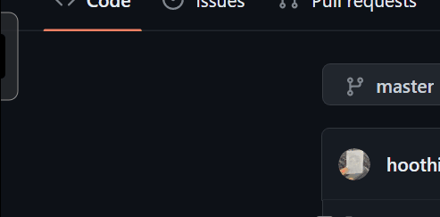

Markdown
# Rust Clock 
[]

每半小时弹出的时钟插件。使用 [rust](https://github.com/rust-lang/rust)|[egui](https://github.com/emilk/egui/)|[rodio](https://github.com/RustAudio/rodio)|[tray-icon](https://github.com/tauri-apps/tray-icon)|[chrono](https://github.com/chronotope/chrono)|[rust-ini](https://github.com/zonyitoo/rust-ini) 构建。



# 配置 (Config)
编辑 `popalarm` 旁边的 `conf.ini` 文件，删除对应项前的注释符号 `#`。

## 目录 (TOC)
1. [time 时刻](#time)
2. [sound 音效](#sound)
3. [countdown 倒计时](#countdown)
4. [pos 位置](#pos)
5. [color 颜色](#color)
6. [show_time 驻留时间](#show_time)
7. [tips 提示文字](#tips)
8. [font_path 提示字体](#font_path)
9. [bg 背景图](#bg)
10. [init_show 启动时显示](#init_show)
11. [timezone 时区](#timezone)
12. [time_font 时间数字字体](#time_font)
13. [round 圆角](#round)
14. [time_countdown 定点倒计时](#time_countdown)

---

+ **time**
<a id="time"></a>
> 设置 rust clock 弹出的时刻，使用 `时:分:秒` 的格式，多个时刻使用 `,` 分隔。弹出时无视倒计时。
``` ini
# 每一个钟头的 30 分钟弹出
time=:30:
Ini, TOML
# 每一个钟头的 30 分钟与 15 点整弹出
time=:30:,15::0
sound
<a id="sound"></a>

弹出时播放的音效文件。

Ini, TOML
# 弹出时播放同目录下的 sound.ogg 文件
sound=sound.ogg
Ini, TOML
# 设定第一个报时播放 assets/1.mp3，设定的第二个报时播放 assets/2.mp3
sound=assets/1.mp3|assets/2.mp3
Ini, TOML
# 在上面的基础上区分倒计时音效，第一个倒计时播放 assets/3.mp3，第二个倒计时播放 assets/4.mp3
sound=assets/1.mp3|assets/2.mp3*assets/3.mp3|assets/4.mp3
countdown
<a id="countdown"></a>

倒计时，使用 时:分:秒 的格式，多个倒计时使用 , 分隔。默认为 10 分钟，开启后会循环启动。

Ini, TOML
# 20-20-20 Rule 护眼法则
countdown=:20:,::20
pos
<a id="pos"></a>

rust clock 的弹出位置。

Ini, TOML
# 在屏幕右侧弹出，弹出位置距离屏幕顶部 20% 高度
pos=right,20%
color
<a id="color"></a>

rust clock 各个位置的颜色。格式为 r,g,b 或者 r,g,b,a。

Ini, TOML
# 背景颜色
bg_color=207,210,206,200

# 边框颜色
border_color=91,105,114

# 数字背景颜色
number_bg_color=235,235,235

# 数字颜色
number_color=0,0,0

# 钟面背景颜色
clock_bg_color=235,235,235
show_time
<a id="show_time"></a>

弹出后持续显示时长，按毫秒计算。

Ini, TOML
# 弹出后持续显示 1000 毫秒
show_time=1000
tips
<a id="tips"></a>

弹出后显示的文字，格式同 sound，可设置多个。

Ini, TOML
# 弹出时显示 'by the grave and thee'
tips=by the grave and thee
font_path
<a id="font_path"></a>

弹出文字使用的字体路径。

Ini, TOML
# 使用位于 'C:/Windows/Fonts/zongyi.TTF' 的字体
font_path=C:/Windows/Fonts/zongyi.TTF
bg
<a id="bg"></a>

背景图片的路经，尺寸为 8080 时设置为钟面背景，尺寸为 320100 时设置为整体背景。

Ini, TOML
bg=assets/bg.png
init_show
<a id="init_show"></a>

启动后立即显示，0 为禁用显示，1 为启用。

Ini, TOML
init_show=0
timezone
<a id="timezone"></a>

时区，从 -12（西12区） 到 +12（东12区）。

Ini, TOML
timezone=+9
time_font
<a id="time_font"></a>

时刻数字使用的字体路径。

Ini, TOML
time_font=C:/Windows/Fonts/zongyi.TTF
round
<a id="round"></a>

是否使用圆角边框，0 为否。

Ini, TOML
round=0
time_countdown
<a id="time_countdown"></a>

显示直到 time 中第一个时分秒都完整设置时间的倒计时。1 为启用。

与 countdown 的区别： 此项显示到固定时间点的倒计时，而非自启动时间起的循环倒计时。

Ini, TOML
time_countdown=1